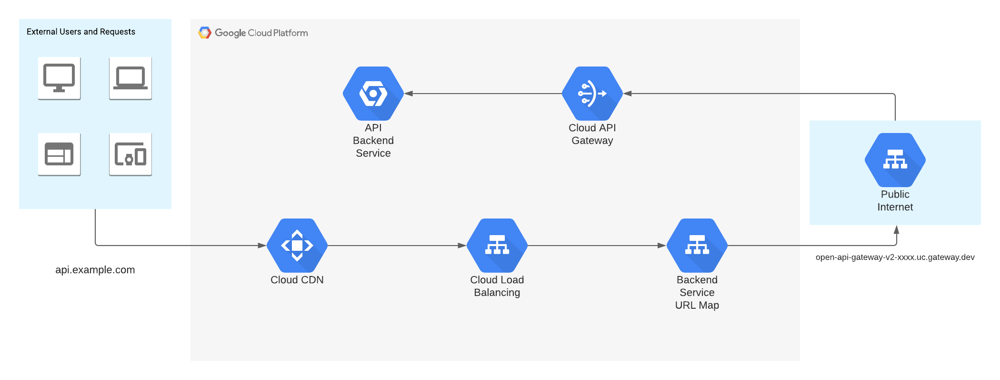

# Creating Custom Domains For GCP API Gateway With Terraform

When it comes to writing a custom API for your services, you may want to assign it to a custom DNS record. 
Whether you plan to use it internally or expose it publicly, having a readable and consistent naming scheme for your API 
endpoints is invaluable.  This enables you to split APIs by environment (dev, test, prod), service levels, or any other 
desired organizational components.  This separation can allow for better testing, resource isolation, and network segmentation 
within your application and cloud environments.

At time of writing Google Cloud API Gateway is in beta, and using custom domains for your endpoints is [not supported natively](https://cloud.google.com/api-gateway/docs/deployment-model#configuring_a_domain_name_server).
While API Gateway does provide you with a public url for hitting your endpoints they are not the most readable. 
Instead we can employ a combination of load balancing, Cloud CDN, and Cloud DNS to effectively reroute any calls to the 
API endpoint as described in [this article](https://medium.com/swlh/google-api-gateway-and-load-balancer-cdn-9692b7a976df).
Codifying this in Terraform allows for reusability and modularity while maintaining an organized, auditable record of 
your cloud infrastructure.

The following steps assume you have an API Gateway already set up in your cloud environment as the Terraform resource 
`google_api_gateway_gateway.api_gateway`.  For instructions on deploying
this via Terraform see the [Terraform API Gateway docs](https://registry.terraform.io/providers/hashicorp/google/latest/docs/resources/api_gateway_gateway). 
You can also substitute any mentions of this resource with hardcoded strings if you decide against using Terraform to create 
or import your existing API Gateway.



## Cloud DNS Managed Zone
The first logical step here is to deploy your [DNS managed zone](https://registry.terraform.io/providers/hashicorp/google/latest/docs/resources/dns_managed_zone).  This is where you will deploy your DNS records for redirecting
to your desired endpoint.  

**_This step must come first_**, since you will need to verify your load balancer's SSL certificates with this managed zone. 
It is in fact recommended to spin this up prior to applying the rest of the steps here due to quirks with GCP's load 
balancing and Network Endpoint Group systems.  These offerings are in beta at time of writing and bugs are to be 
expected prior to full release.

```hcl
resource "google_dns_managed_zone" "managed_zone" {
  name     = var.zone_name
  dns_name = var.dns_name
}
```

## Network Endpoint Groups
In order to put our endpoints behind a load balancer we need to create a [Network Endpoint Group](https://registry.terraform.io/providers/hashicorp/google/latest/docs/resources/compute_global_network_endpoint_group) (NEG).  Normally you would put 
instance or other network services behind this for a load balancer to manage.  In our case we're going to put a single 
publicly accessible address in the group for routing.

```hcl
resource "google_compute_global_network_endpoint_group" "api_neg" {
  name                  = "apigw-neg"
  network_endpoint_type = "INTERNET_FQDN_PORT"
}
```

The `INTERNET_FQDN_PORT` endpoint type allows us to point the group at any fully qualified domain name accessible on the internet.

Now we need the actual endpoint for this group, so we can point our load balancer at it.  The API gateway is referenced 
here since we are passing it in as the FQDN we want to proxy to in this endpoint.

```hcl
resource "google_compute_global_network_endpoint" "api_endpoint" {
  global_network_endpoint_group = google_compute_global_network_endpoint_group.api_neg.id
  port                          = 443
  fqdn                          = google_api_gateway_gateway.api_gateway.default_hostname
}
```

## Load Balancing
Now that we have our NEG set up, we need a load balancer to point to it.  There are a number of interlocking pieces here 
including a [URL map](https://registry.terraform.io/providers/hashicorp/google/latest/docs/resources/compute_url_map) and forwarding rules.  

First we need the [backend service](https://registry.terraform.io/providers/hashicorp/google/latest/docs/resources/compute_backend_service) itself with its URL map.  This resource is in beta so 
make sure you have a `google-beta` provider defined in your providers file.

```hcl
resource "google_compute_backend_service" "api_lb_backend" {
  provider               = google-beta
  name                   = "apigw-lb-backend"
  enable_cdn             = true
  protocol               = "HTTP2"
  custom_request_headers = ["Host: ${google_compute_global_network_endpoint.api_endpoint.fqdn}"]

  backend {
    group = google_compute_global_network_endpoint_group.api_neg.id
  }
}

resource "google_compute_url_map" "api_url_map" {
  name            = "apigw-url-map"
  default_service = google_compute_backend_service.api_lb_backend.id
}
```

We need an [SSL certificate](https://registry.terraform.io/providers/hashicorp/google/latest/docs/resources/compute_managed_ssl_certificate) for our forwarding rules and HTTPS proxy.  Again ensure you have already created your managed 
DNS zone before this.  Using `depends_on` does not always work in this case due to the validation and activation time for SSL 
certificates in GCP.  Make sure your subdomain matches up with your existing DNS zone in the `managed` section below.

```hcl
resource "google_compute_managed_ssl_certificate" "api_ssl_cert" {
  name = "apigw-ssl-cert"

  managed {
    domains = ["api.my-domain.com"]
  }
}
```

The last piece of the load balancing puzzle is our [forwarding rule](https://registry.terraform.io/providers/hashicorp/google/latest/docs/resources/compute_global_forwarding_rule) and [HTTPS proxy](https://registry.terraform.io/providers/hashicorp/google/latest/docs/resources/compute_target_https_proxy).  The [global address](https://registry.terraform.io/providers/hashicorp/google/latest/docs/resources/compute_global_address) allows us to expose 
this endpoint to the world.

```hcl
resource "google_compute_target_https_proxy" "api_target_proxy" {
  name             = "apigw-target-proxy"
  ssl_certificates = [google_compute_managed_ssl_certificate.api_ssl_cert.id]
  url_map          = google_compute_url_map.api_url_map.id
}

resource "google_compute_global_address" "api_fwd_address" {
  name = "apigw-fwd-rule-address"
}

resource "google_compute_global_forwarding_rule" "api_fwd_rule" {
  name        = "apigw-fwd-rule"
  target      = google_compute_target_https_proxy.api_target_proxy.id
  ip_protocol = "TCP"
  port_range  = "443"
  ip_address  = google_compute_global_address.api_fwd_address.address
}
```

## DNS Alias Record
Finally we need our actual custom subdomain.  Make sure you align this with your managed zone naming.
```hcl
resource "google_dns_record_set" "api" {
  managed_zone = google_dns_managed_zone.managed_zone.name
  name         = "api-.${google_dns_managed_zone.managed_zone.dns_name}"
  rrdatas      = [google_compute_global_address.api_fwd_address.address]
  ttl          = 300
  type         = "A"
}
```

## Wrapping Up and Testing
With everything deployed, check that your SSL certificate has been validated and marked `ACTIVE` before hitting your API 
endpoint.  The certificate is visible in the load balancer view in the GCP console.  

To test your API simply hit your new A record at the path specified in your API gateway config.  If you get a `502` error 
you may need to wait for the certificate to fully activate.  Otherwise try fully destroying all components and 
redeploy the SSL certificate first to give it time to be validated.

Most issues will stem from the interactivity between your DNS Managed Zone, records, and the SSL certificate.  If you 
continue to have issues with these, I would recommend moving them to their own set of Terraform configs as part of a separate 
deployment.  Remember you can always [reference other Terraform states](https://www.terraform.io/docs/language/state/remote-state-data.html) to pull in their data

## Links and References
* [This blog as a repository, with code samples](https://github.com/adispen/gcp-apigateway-custom-domain)
* [Google API Gateway, Load Balancer, and Content Delivery Network by Mohan Ganesh (non-Terraform solution)](https://medium.com/swlh/google-api-gateway-and-load-balancer-cdn-9692b7a976df)
* [GCP API Gateway Docs](https://cloud.google.com/api-gateway)
* [GCP API Gateway Terraform Docs](https://registry.terraform.io/providers/hashicorp/google/latest/docs/resources/api_gateway_gateway)
